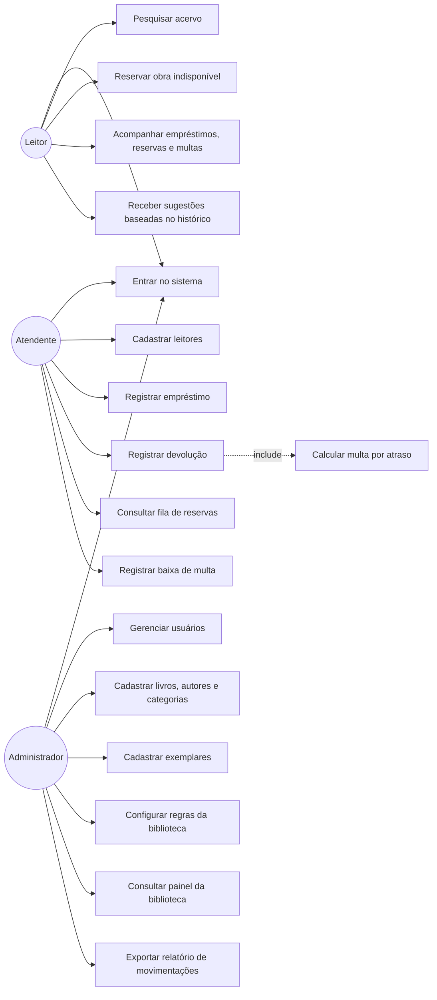
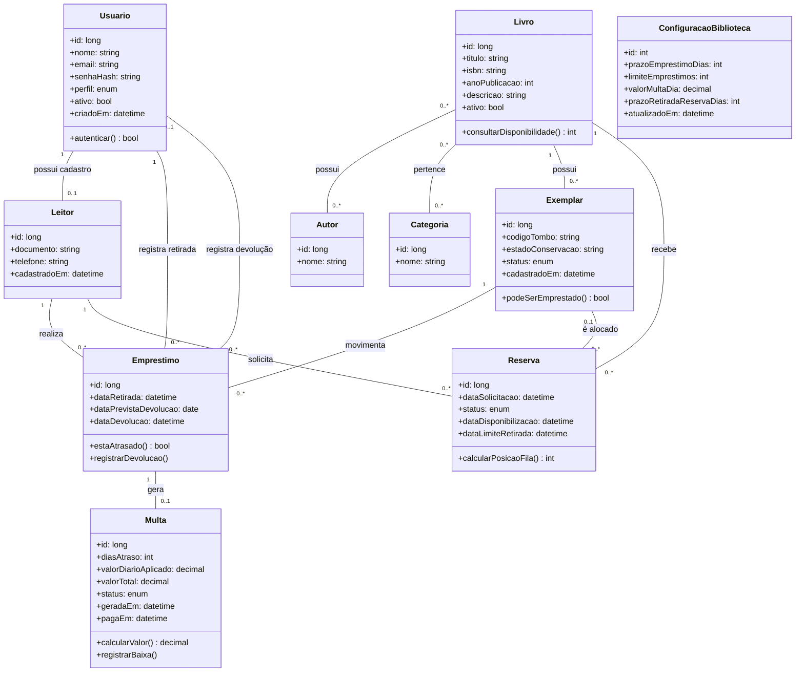

# Diagramas UML — Biblioteca Viva

**Equipe:** Raniery Chiarelli (2840482321007) — Vinicius Rocha (2840482523051) — Isaac Leonardo da Silva (2840482421016)  
**Trilha:** B  
**Origem:** Banco de temas nº 9 — Controle de biblioteca comunitária  
**Data:** 04/09/2026

## 1. Diagrama de Casos de Uso

## 2. Diagrama de Classes

## 3. Rastreabilidade — caso de uso → história do backlog

| Caso de uso | História(s) relacionada(s) (E2) |
|---|---|
| Entrar no sistema | #1 |
| Pesquisar acervo | #6 |
| Reservar obra indisponível | #9 |
| Acompanhar empréstimos, reservas e multas | #12 |
| Receber sugestões baseadas no histórico | #15 |
| Cadastrar leitores | #3 |
| Registrar empréstimo | #7 |
| Registrar devolução | #8 |
| Consultar fila de reservas | #10 |
| Registrar baixa de multa | #11 |
| Calcular multa por atraso | #11 |
| Gerenciar usuários | #2 |
| Cadastrar livros, autores e categorias | #4 |
| Cadastrar exemplares | #5 |
| Configurar regras da biblioteca | #13 |
| Consultar painel da biblioteca | #14 |
| Exportar relatório de movimentações | #16 |
