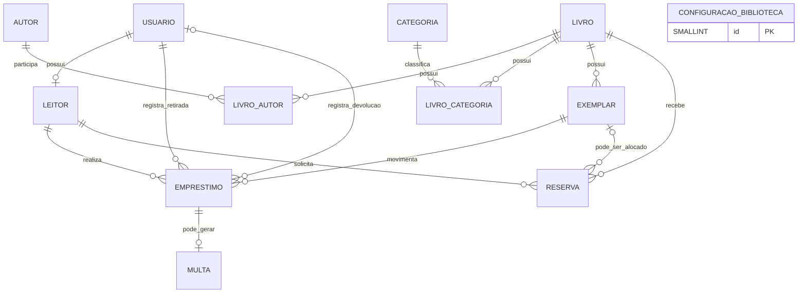

# DER — Biblioteca Viva

**Equipe:** Raniery Chiarelli (2840482321007) — Vinicius Rocha (2840482523051) — Isaac Leonardo da Silva (2840482421016)  
**Trilha:** B  
**Origem:** Banco de temas nº 9 — Controle de biblioteca comunitária  
**Data:** 04/09/2026

## 1. Diagrama Entidade-Relacionamento

### Leitura das principais cardinalidades

- Um usuário pode possuir zero ou um cadastro de leitor; cada leitor corresponde obrigatoriamente a um usuário.
- Um livro pode possuir vários exemplares físicos.
- Livro e Autor possuem uma relação N:N, resolvida por `livro_autor`.
- Livro e Categoria possuem uma relação N:N, resolvida por `livro_categoria`.
- Um leitor pode realizar vários empréstimos e reservas ao longo do tempo.
- Um exemplar pode aparecer em vários empréstimos históricos, mas em apenas um empréstimo ativo por vez.
- Uma reserva pertence a uma obra. Quando chega a vez do leitor, um exemplar pode ser alocado à reserva.
- Um empréstimo pode gerar no máximo uma multa.

## 2. Dicionário de dados

### Tabela: `usuario`

Armazena os dados de autenticação e autorização de todos os usuários do sistema.

| Campo | Tipo | Restrições | Descrição |
|---|---|---|---|
| id | BIGSERIAL | PK | Identificador do usuário |
| nome | VARCHAR(120) | NOT NULL | Nome completo |
| email | VARCHAR(160) | NOT NULL, UNIQUE | E-mail utilizado no login |
| senha_hash | VARCHAR(255) | NOT NULL | Hash da senha; a senha original não será armazenada |
| perfil | VARCHAR(20) | NOT NULL, CHECK IN (`leitor`, `atendente`, `administrador`) | Perfil de acesso |
| ativo | BOOLEAN | NOT NULL, DEFAULT TRUE | Define se o usuário pode acessar o sistema |
| criado_em | TIMESTAMPTZ | NOT NULL, DEFAULT CURRENT_TIMESTAMP | Data e hora do cadastro |

### Tabela: `leitor`

Complementa o usuário com os dados necessários para utilizar os serviços da biblioteca.

| Campo | Tipo | Restrições | Descrição |
|---|---|---|---|
| id | BIGSERIAL | PK | Identificador do leitor |
| usuario_id | BIGINT | FK → `usuario.id`, NOT NULL, UNIQUE | Garante a relação 1:1 com o usuário |
| documento | VARCHAR(30) | NOT NULL, UNIQUE | CPF ou outro documento de identificação |
| telefone | VARCHAR(25) | NULL | Telefone para contato |
| cadastrado_em | TIMESTAMPTZ | NOT NULL, DEFAULT CURRENT_TIMESTAMP | Data e hora do cadastro como leitor |

### Tabela: `autor`

Armazena os autores das obras.

| Campo | Tipo | Restrições | Descrição |
|---|---|---|---|
| id | BIGSERIAL | PK | Identificador do autor |
| nome | VARCHAR(160) | NOT NULL | Nome do autor |

### Tabela: `categoria`

Armazena as categorias utilizadas para classificar as obras.

| Campo | Tipo | Restrições | Descrição |
|---|---|---|---|
| id | BIGSERIAL | PK | Identificador da categoria |
| nome | VARCHAR(80) | NOT NULL, UNIQUE | Nome da categoria |

### Tabela: `livro`

Representa uma obra do acervo, independentemente da quantidade de exemplares físicos.

| Campo | Tipo | Restrições | Descrição |
|---|---|---|---|
| id | BIGSERIAL | PK | Identificador da obra |
| titulo | VARCHAR(200) | NOT NULL | Título da obra |
| isbn | VARCHAR(13) | NOT NULL, UNIQUE, CHECK de 10 ou 13 caracteres | ISBN sem pontuação |
| ano_publicacao | SMALLINT | NULL, CHECK >= 1000 | Ano de publicação; o limite pelo ano atual será validado pela aplicação |
| descricao | TEXT | NULL | Sinopse ou observações sobre a obra |
| ativo | BOOLEAN | NOT NULL, DEFAULT TRUE | Permite ocultar a obra sem apagar seu histórico |

### Tabela: `livro_autor`

Tabela associativa da relação N:N entre livros e autores.

| Campo | Tipo | Restrições | Descrição |
|---|---|---|---|
| livro_id | BIGINT | PK composta, FK → `livro.id` | Livro relacionado |
| autor_id | BIGINT | PK composta, FK → `autor.id` | Autor relacionado |

### Tabela: `livro_categoria`

Tabela associativa da relação N:N entre livros e categorias.

| Campo | Tipo | Restrições | Descrição |
|---|---|---|---|
| livro_id | BIGINT | PK composta, FK → `livro.id` | Livro relacionado |
| categoria_id | BIGINT | PK composta, FK → `categoria.id` | Categoria relacionada |

### Tabela: `exemplar`

Representa cada unidade física de uma obra.

| Campo | Tipo | Restrições | Descrição |
|---|---|---|---|
| id | BIGSERIAL | PK | Identificador do exemplar |
| livro_id | BIGINT | FK → `livro.id`, NOT NULL | Obra à qual o exemplar pertence |
| codigo_tombo | VARCHAR(50) | NOT NULL, UNIQUE | Código individual do exemplar |
| estado_conservacao | VARCHAR(20) | NOT NULL, CHECK IN (`novo`, `bom`, `regular`, `danificado`) | Estado físico atual |
| status | VARCHAR(20) | NOT NULL, DEFAULT `disponivel`, CHECK IN (`disponivel`, `emprestado`, `reservado`, `inativo`) | Situação atual para circulação |
| cadastrado_em | TIMESTAMPTZ | NOT NULL, DEFAULT CURRENT_TIMESTAMP | Data e hora do cadastro |

### Tabela: `emprestimo`

Registra a retirada e a devolução de um exemplar.

| Campo | Tipo | Restrições | Descrição |
|---|---|---|---|
| id | BIGSERIAL | PK | Identificador do empréstimo |
| leitor_id | BIGINT | FK → `leitor.id`, NOT NULL | Leitor que retirou o exemplar |
| exemplar_id | BIGINT | FK → `exemplar.id`, NOT NULL | Exemplar emprestado |
| atendente_retirada_id | BIGINT | FK → `usuario.id`, NOT NULL | Atendente que registrou a retirada |
| atendente_devolucao_id | BIGINT | FK → `usuario.id`, NULL | Atendente que registrou a devolução |
| data_retirada | TIMESTAMPTZ | NOT NULL, DEFAULT CURRENT_TIMESTAMP | Data e hora da retirada |
| data_prevista_devolucao | DATE | NOT NULL, CHECK >= data da retirada | Prazo concedido para devolução |
| data_devolucao | TIMESTAMPTZ | NULL, CHECK posterior ou igual à retirada | Preenchida quando o exemplar é devolvido |

**Restrição adicional:** deve existir um índice único parcial sobre `exemplar_id` enquanto `data_devolucao IS NULL`, impedindo dois empréstimos ativos do mesmo exemplar.

### Tabela: `reserva`

Registra a fila de leitores interessados em uma obra indisponível.

| Campo | Tipo | Restrições | Descrição |
|---|---|---|---|
| id | BIGSERIAL | PK | Identificador da reserva |
| leitor_id | BIGINT | FK → `leitor.id`, NOT NULL | Leitor que solicitou a reserva |
| livro_id | BIGINT | FK → `livro.id`, NOT NULL | Obra reservada |
| exemplar_id | BIGINT | FK → `exemplar.id`, NULL | Exemplar alocado quando chegar a vez do leitor |
| data_solicitacao | TIMESTAMPTZ | NOT NULL, DEFAULT CURRENT_TIMESTAMP | Momento usado para ordenar a fila |
| status | VARCHAR(20) | NOT NULL, DEFAULT `ativa`, CHECK IN (`ativa`, `disponivel`, `atendida`, `cancelada`, `expirada`) | Situação da reserva |
| data_disponibilizacao | TIMESTAMPTZ | NULL | Momento em que um exemplar foi separado |
| data_limite_retirada | TIMESTAMPTZ | NULL | Prazo final para o leitor retirar o exemplar |

**Restrições adicionais:**

- Um índice único parcial em `(leitor_id, livro_id)` para reservas com status `ativa` ou `disponivel` impede reserva duplicada.
- Um índice único parcial em `exemplar_id` para reservas com status `disponivel` impede que o mesmo exemplar seja separado para duas pessoas.
- A posição não é armazenada. Ela é calculada pela ordem de `data_solicitacao` e, em caso de empate, por `id`.

### Tabela: `multa`

Registra o valor gerado por atraso em um empréstimo.

| Campo | Tipo | Restrições | Descrição |
|---|---|---|---|
| id | BIGSERIAL | PK | Identificador da multa |
| emprestimo_id | BIGINT | FK → `emprestimo.id`, NOT NULL, UNIQUE | Garante no máximo uma multa por empréstimo |
| dias_atraso | INTEGER | NOT NULL, CHECK > 0 | Quantidade de dias de atraso |
| valor_diario_aplicado | NUMERIC(10,2) | NOT NULL, CHECK >= 0 | Valor diário vigente quando a multa foi criada |
| valor_total | NUMERIC(10,2) | GENERATED ALWAYS AS (`dias_atraso * valor_diario_aplicado`) STORED | Resultado calculado e armazenado automaticamente |
| status | VARCHAR(20) | NOT NULL, DEFAULT `pendente`, CHECK IN (`pendente`, `quitada`, `cancelada`) | Situação do pagamento |
| gerada_em | TIMESTAMPTZ | NOT NULL, DEFAULT CURRENT_TIMESTAMP | Data e hora da geração |
| paga_em | TIMESTAMPTZ | NULL | Data e hora da baixa da multa |

### Tabela: `configuracao_biblioteca`

Mantém as regras configuráveis utilizadas nos empréstimos, reservas e multas.

| Campo | Tipo | Restrições | Descrição |
|---|---|---|---|
| id | SMALLINT | PK, CHECK (`id = 1`) | Identificador fixo da configuração única |
| prazo_emprestimo_dias | SMALLINT | NOT NULL, CHECK > 0 | Prazo padrão para devolução |
| limite_emprestimos | SMALLINT | NOT NULL, CHECK > 0 | Máximo de empréstimos ativos por leitor |
| valor_multa_dia | NUMERIC(10,2) | NOT NULL, CHECK >= 0 | Valor cobrado por dia de atraso |
| prazo_retirada_reserva_dias | SMALLINT | NOT NULL, CHECK > 0 | Tempo concedido para retirar um exemplar reservado |
| atualizado_em | TIMESTAMPTZ | NOT NULL, DEFAULT CURRENT_TIMESTAMP | Data e hora da última alteração |

## 3. Regras de integridade e dados derivados

- O perfil dos usuários informados como atendentes nos empréstimos deve ser validado pela aplicação como `atendente` ou `administrador`.
- Um exemplar só pode ser emprestado quando seu status for `disponivel` e o leitor estiver ativo e abaixo do limite configurado.
- A devolução atualiza o exemplar para `disponivel` ou `reservado`, conforme a existência de fila para a obra.
- O exemplar alocado a uma reserva deve pertencer ao mesmo livro informado na reserva.
- O atraso não é armazenado como status: ele é identificado quando `data_devolucao` estiver vazia e `data_prevista_devolucao` for anterior à data atual.
- A posição na fila é calculada consultando as reservas ativas da obra em ordem de solicitação.
- Totais do dashboard e sugestões de leitura são resultados de consultas; não são armazenados em tabelas próprias.
- Exclusões de registros com histórico devem ser evitadas. Para usuários e livros, utiliza-se o campo `ativo`.

## 4. Normalização

O modelo atende à Terceira Forma Normal (3FN):

- Cada tabela representa um único assunto e possui uma chave que identifica seus registros.
- Os atributos são atômicos e não existem listas de autores ou categorias dentro de `livro`.
- As relações N:N foram resolvidas pelas tabelas associativas `livro_autor` e `livro_categoria`.
- Dados específicos de leitores foram separados dos dados comuns de autenticação de `usuario`.
- `multa` referencia `emprestimo`, sem repetir leitor, exemplar ou datas que já podem ser obtidos por essa relação.
- Posição da fila, situação de atraso, disponibilidade agregada e totais do dashboard são calculados, evitando informações redundantes e inconsistentes.

## 5. Rastreabilidade com o backlog da E2

| História | Tabelas e estruturas relacionadas |
|---|---|
| #1–#3 — autenticação, usuários e leitores | `usuario`, `leitor` |
| #4 — livros, autores e categorias | `livro`, `autor`, `categoria`, `livro_autor`, `livro_categoria` |
| #5–#6 — exemplares e pesquisa do acervo | `livro`, `exemplar`, `autor`, `categoria` |
| #7–#8 — empréstimo e devolução | `emprestimo`, `leitor`, `exemplar`, `usuario` |
| #9–#10 — reservas e fila | `reserva`, `leitor`, `livro`, `exemplar` |
| #11 — cálculo e baixa de multa | `multa`, `emprestimo`, `configuracao_biblioteca` |
| #12 — área do leitor | `emprestimo`, `reserva`, `multa` |
| #13 — regras configuráveis | `configuracao_biblioteca` |
| #14 — dashboard | consultas agregadas sobre `emprestimo`, `exemplar`, `livro`, `livro_categoria` e `categoria` |
| #15 — sugestões de leitura | histórico de `emprestimo` relacionado a `livro_categoria` e `categoria` |
| #16 — exportação CSV | consulta das movimentações registradas em `emprestimo` |
